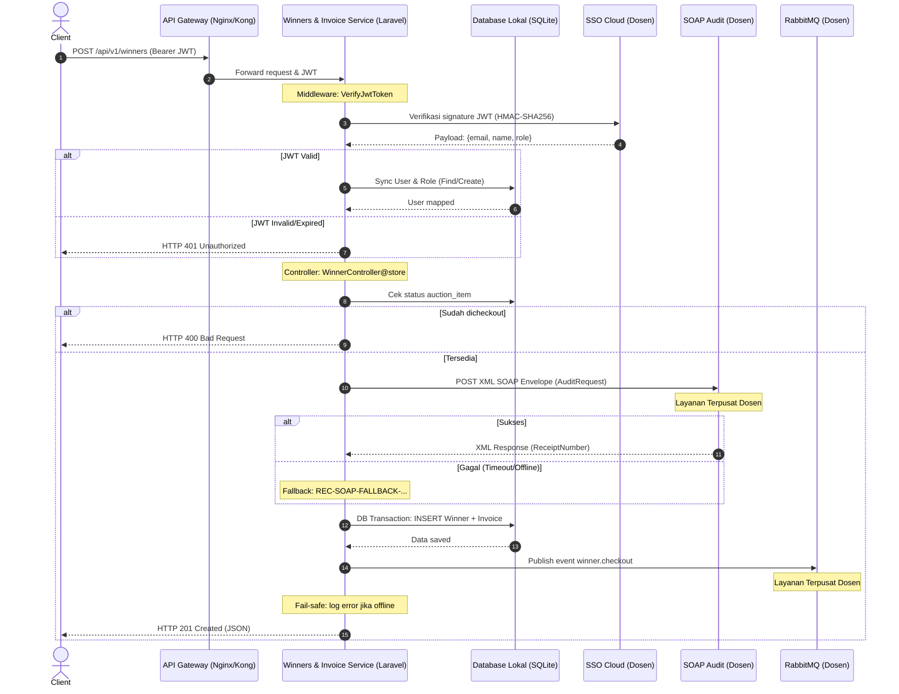

# Dokumentasi Analisis Tugas 3 — Integrasi Aplikasi Enterprise

## Modul: Pemenang & Invoice (Winners & Invoice Microservice)

**NRP**: 102022400076

---

## 1. Klasifikasi Transaksi Kritis (State-Changing)

Transaksi **Proses Checkout Barang Lelang** (`POST /api/v1/winners`) merupakan satu-satunya transaksi *state-changing* dalam microservice ini. Transaksi ini dikategorikan **kritis** karena dua karakteristik integrasi enterprise:

### A. Transaksi Penting — SOAP (Synchronous Audit)

Transaksi ini **wajib diaudit** secara real-time ke **Legacy SOAP XML Audit** milik dosen/institusi sebelum data dianggap sah. Alasan:

| Aspek | Penjelasan |
|-------|-----------|
| **Dampak Finansial** | Checkout mengubah status kepemilikan barang dan menerbitkan invoice dengan nominal `winning_bid`. |
| **Kepatuhan (Compliance)** | Setiap transaksi keuangan wajib tercatat di sistem audit pusat sebelum disimpan ke database lokal. |
| **Sinkronus (SOAP)** | Sistem menunggu `ReceiptNumber` dari SOAP Audit sebagai bukti pencatatan sah. Jika SOAP *offline*, sistem menggunakan **fallback** (`REC-SOAP-FALLBACK-...`) agar bisnis tetap berjalan. |

**Implementasi**: `app/Services/SoapAuditService.php` — mengirim SOAP Envelope XML ke `SOAP_AUDIT_URL` (http://cloud-dosen.test/soap/audit) dengan namespace `http://audit.enterprise.digital.city`.

### B. Transaksi Disebarkan — RabbitMQ (Asynchronous Event Distribution)

Setelah transaksi tercatat secara sah, detail checkout **disebarkan** ke departemen lain melalui Message Broker agar sistem lain dapat bereaksi:

| Aspek | Penjelasan |
|-------|-----------|
| **Tujuan** | Logistik (persiapan pengiriman), notifikasi email, update sistem akuntansi, dll. |
| **Asinkronus (RabbitMQ)** | Event `winner.checkout` dikirim ke queue `winner_invoice_queue` setelah *database transaction* commit. |
| **Fail-safe** | Jika RabbitMQ *offline*, error dicatat di log dan transaksi tetap dianggap berhasil. |

**Implementasi**: `app/Services/RabbitMQPublisher.php` — menggunakan `php-amqplib/php-amqplib`, publish JSON payload ke queue `winner_invoice_queue`.

### Ringkasan Pola Komunikasi

```
Checkout Transaction
  ├── Synchronous (wajib): SOAP Audit → ReceiptNumber
  ├── Database Transaction: Simpan Winner + Invoice
  └── Asynchronous (sebaran): RabbitMQ → winner.checkout
```

---

## 2. Sequence Diagram Internal

Diagram berikut menggambarkan aliran interaksi internal dengan **layanan terpusat yang disediakan dosen** (SSO JWT, SOAP Audit, RabbitMQ) saat memproses checkout:



---

## 3. Layanan Terpusat (Disediakan Dosen)

| Layanan | Jenis | Endpoint/Konfigurasi | Fungsi |
|---------|-------|---------------------|--------|
| **SSO Cloud** | JWT Federated | `dosen_secret_key` (HS256) | Autentikasi dan role mapping |
| **SOAP Audit** | Legacy SOAP XML | `http://cloud-dosen.test/soap/audit` | Validasi dan audit transaksi |
| **RabbitMQ** | Message Broker | `localhost:5672`, queue: `winner_invoice_queue` | Distribusi event ke sistem lain |

---

## 4. Dokumentasi Lengkap

Dokumen analisis detail tersedia di:
- **`analisis_tugas_3.md`** — Analisis lengkap, sequence diagram, dan detail mekanisme integrasi
- **`WinnerInvoice-API.postman_collection.json`** — Koleksi Postman untuk uji coba API

---

## 5. Setup & Menjalankan

```bash
# Install dependencies
composer install

# Copy environment
copy .env.example .env

# Generate app key
php artisan key:generate

# Run database migration with seeder
php artisan migrate --seed

# Start server
php artisan serve
```

Enviromen config (sesuaikan di `.env`):
```
SOAP_AUDIT_URL=http://cloud-dosen.test/soap/audit
RABBITMQ_HOST=localhost
RABBITMQ_PORT=5672
RABBITMQ_USER=guest
RABBITMQ_PASSWORD=guest
RABBITMQ_QUEUE=winner_invoice_queue
SSO_JWT_KEY=dosen_secret_key
SSO_JWT_ALGO=HS256
```
