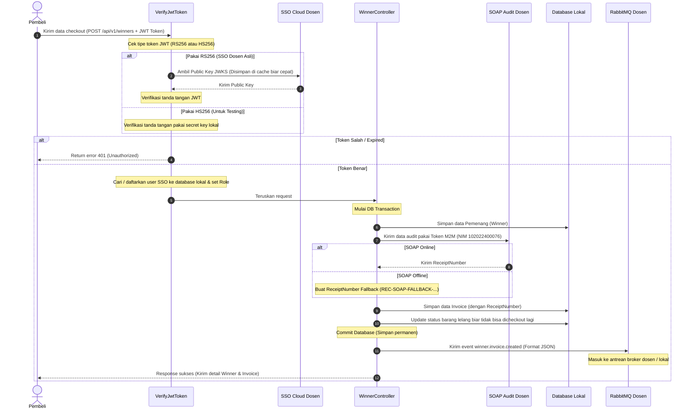

# Dokumen Analisis Tugas 3

**Nama:** Raqieza Walloaz  
**NIM:** 102022400076  
**Kelas:** SI-48-08  

---

### 1. Transaksi Kritis (State-Changing)

Di project Winner & Invoice ini, transaksi yang paling krusial dan mengubah data (state-changing) adalah **Proses Checkout Pemenang Lelang** (`POST /api/v1/winners`). 

Kenapa transaksi ini sangat kritis? Karena transaksi ini harus melakukan dua hal penting sekaligus:

   **Laporan Audit Keuangan (SOAP - Sinkronus)**
    Sebelum data checkout disimpan di database kita, data ini wajib dilaporkan ke server SOAP Audit milik dosen. 
       **Kenapa harus sinkronus?** Karena ini berkaitan dengan uang. Kita harus memastikan server pusat mencatat transaksi ini dulu dan memberikan nomor bukti (`ReceiptNumber`).
       **Antisipasi Error (Fallback):** Kalau server SOAP dosen lagi mati/down, sistem saya otomatis membuat kode bukti sendiri (`REC-SOAP-FALLBACK-...`). Jadi transaksi checkout di web tidak ikutan macet atau error.

   **Penyebaran Event Invoice (RabbitMQ - Asinkronus)**
    Setelah data berhasil masuk database, sistem akan menyebarkan info invoice baru ini ke bagian lain (seperti pengiriman/logistik atau email) lewat RabbitMQ.
       **Kenapa asinkronus?** Supaya proses checkout di web tetap cepat bagi pembeli. Kita tidak perlu menunggu proses logistik selesai untuk menampilkan halaman sukses.

---

### 2. Sequence Diagram Aliran Integrasi

Berikut alur jalannya data pas pembeli checkout lelang:

---

### 3. Penjelasan Teknis Singkat

*   **Autentikasi SSO**: Proses verifikasi JWT ada di [VerifyJwtToken.php](file:///c:/Users/LOQ%2015IRX9/Documents/102022400076-winner-invoice/app/Http/Middleware/VerifyJwtToken.php). Middleware ini membaca token login dan mencocokkannya ke kunci publik dari server JWKS dosen.
*   **Audit SOAP**: Proses pengiriman XML audit ada di [SoapAuditService.php](file:///c:/Users/LOQ%2015IRX9/Documents/102022400076-winner-invoice/app/Services/SoapAuditService.php). Autentikasi ke server SOAP menggunakan token Machine-to-Machine (M2M) dengan menyertakan API Key dan NIM mahasiswa.
*   **RabbitMQ**: Pengiriman event ada di [RabbitMQPublisher.php](file:///c:/Users/LOQ%2015IRX9/Documents/102022400076-winner-invoice/app/Services/RabbitMQPublisher.php). Event `winner.invoice.created` dikirim memakai driver `amqp` (socket port 5672) atau lewat driver `http` (REST API gateway dosen).
